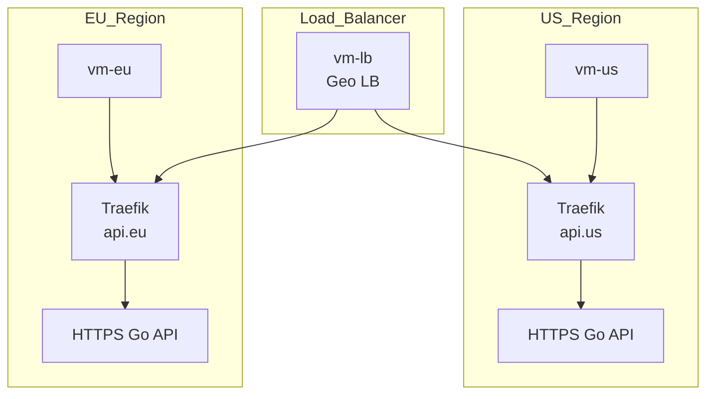

# Demo Traefik

The goal of this project is to setup [this](https://github.com/containous/foobar-api) API and expose it through https.

- The certificate needs to be stored in a persistent volume for the API.
- The API must be deployed on 2 datacenters (EU and US) and load balanced through a third node.


#### Vagrant Virtual Machines

To replicate the different clusters and the load balancer, we will use Vagrant to create 3 virtual machines:
- `vm-eu`: The European cluster
- `vm-us`: The US cluster
- `vm-lb`: The Load Balancer



##### Deployment
To deploy the Vagrant virtual machines, follow these steps:
1. Install [Vagrant](https://www.vagrantup.com/downloads) and [VirtualBox](https://www.virtualbox.org/wiki/Downloads).
2. Install a virtualization provider, such as [VirtualBox](https://www.virtualbox.org/wiki/Downloads).
3. Start the Vagrant VM:
    ```bash
    vagrant up
    ```
   As defined in the `Vagrantfile`. This will create the 3 VMs: `vm-eu`, `vm-us`, and `vm-lb`.
   The command will also copy the kubeconfig files from the VMs to the `terraform/kubeconfigs` directory.
4. SSH into a VM:
    ```bash
    vagrant ssh vm-us
    ```

#### GitOps approach
This project uses a GitOps approach to manage the Kubernetes resources. The whole project is deployable using the `terraform` directory, which contains the necessary Terraform scripts to create the infrastructure and deploy the Kubernetes resources.

How to deploy the project:

:warning: Make sure you already deployed the Vagrant VMs in the past section. This will create the necessary kubeconfig files in the `terraform/kubeconfigs` directory.

- Install [Terraform](https://www.terraform.io/downloads.html) and [kubectl](https://kubernetes.io/docs/tasks/tools/).

In the `terraform` directory, run the following commands:
```bash
terraform init
terraform apply
```

Then add the following lines to your `/etc/hosts` file:

```bash
192.168.56.10	api.us
192.168.56.11	api.eu
```

Then you can access the API through the following URLs:
- https://api.us
- https://api.eu

### Problems tracking

As with every project, there are some issues that I encountered while setting up this demo. Here is a list of the most common issues and their solutions:

- Issue with Vagrant on macOS:
    **Description**: 
    ```
    There was an error while executing `VBoxManage`, a CLI used by Vagrant
    for controlling VirtualBox. The command and stderr is shown below.

    Command: ["startvm", "e1e0e3d4-1cf3-41e2-9f92-11c2c7475fa0", "--type", "headless"]

    Stderr: VBoxManage: error: The VM session was aborted
    VBoxManage: error: Details: code NS_ERROR_FAILURE (0x80004005), component SessionMachine, interface ISession
    ```

    **Solution**: 
    - https://forums.virtualbox.org/viewtopic.php?t=102615
    - Install extra packages for VirtualBox:
    - use a ARM image of ubuntu, since I am on an M1 Mac.

- `http: TLS handshake error from 10.42.0.18:42462: remote error: tls: bad certificate`
    **Description**: 
    Had this error when trying to access the API through the traefik reverse proxy.
    Didn't had the issue when accessing the API directly using port forwarding.

    **Solution**: 
    - I was using a kubernetes ingress not a traefik ingress.
    - Added `passthrough: true`, since the api is already using HTTPS with a self-signed certificate.
      I usually use cert-manager to manage certificates, but in this case it was specified to store the certificate in a pvc. Therefore the API was also written in a way that it can use a self-signed certificate. Meaning that the API is already using HTTPS and traefik should not terminate the TLS connection.

      
- `Traefik geoip setup`
    **Description**: 
    The geoip middleware was not working as expected. It was adding the country code to the request header after the request was routed by traefik in the ingress route.

    **Solution**: 
    - Removed the geoip middleware from the load balancer.
    - Instead, used a cloudflare proxy that adds the country code to the request header before it reaches the load balancer.
    - This way, the country code is added to the request header before traefik decides which service to route the request to.