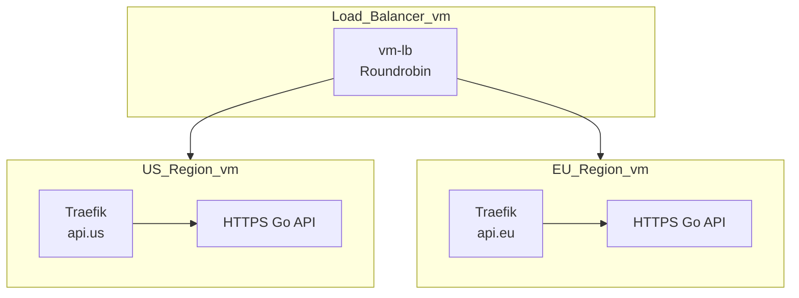
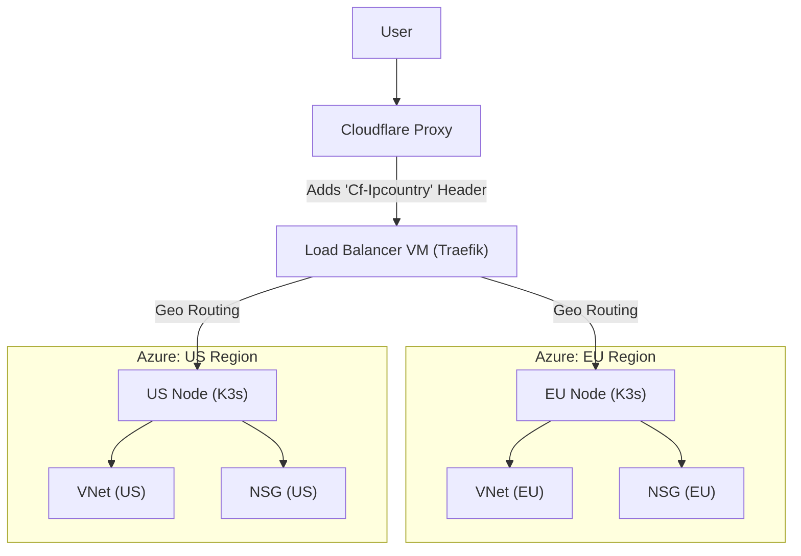
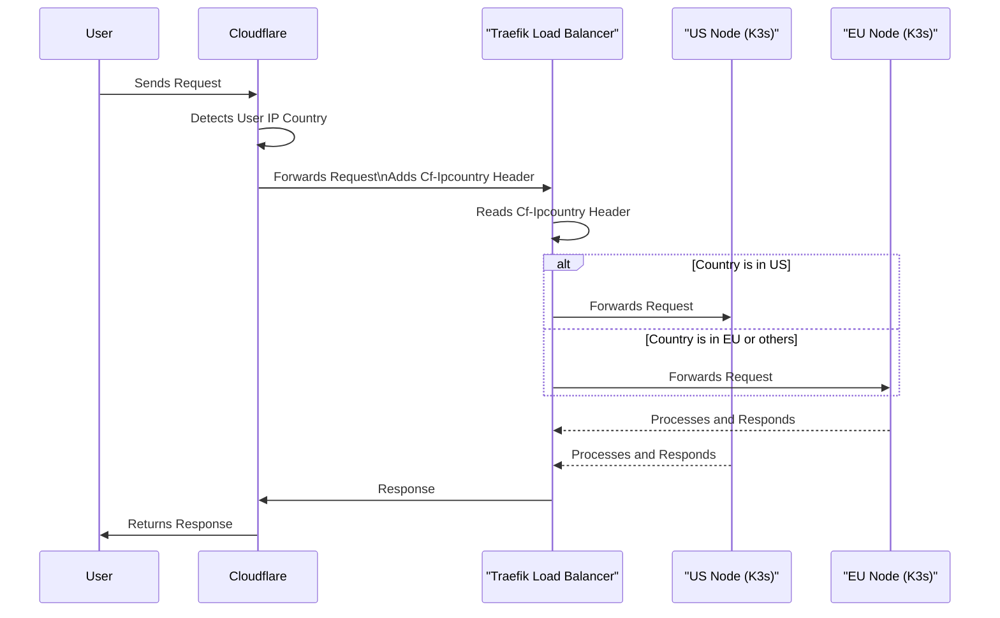

# Distributed API Deployment Demo

This project demonstrates a distributed deployment of a simple API across two regions (EU and US) with a Traefik-based load balancer in front. The deployment supports two modes:

- **Local deployment** using Vagrant and VirtualBox
- **Cloud deployment** on Azure using Terraform

Each deployment creates:
- A **US node** (K3s cluster)
- An **EU node** (K3s cluster)
- A **Load Balancer node** (Traefik)

---

## Deployment Options

### 1. Local Deployment (Vagrant + Terraform)

Use this setup to simulate a multi-region deployment locally.

Refer to the [Vagrant Setup Guide](./vagrant/README.md) for instructions to:

- Install Vagrant and VirtualBox
- Start the 3 virtual machines: `vm-eu`, `vm-us`, and `vm-lb`
- Automatically export the kubeconfigs to the Terraform directory

Then, follow the **local workspace** section in the [Terraform README](./terraform/README.md#local-deployment-with-the-vagrant-vms) to deploy the API and load balancer.

#### Local Infrastructure Schema

The local environment simulates 3 regional nodes on a single host:



#### Vagrant Virtual Machines

To replicate the different clusters and the load balancer, we will use Vagrant to create 3 virtual machines:
- `vm-eu`: The European cluster
- `vm-us`: The US cluster
- `vm-lb`: The Load Balancer


### 2. Azure Deployment (Terraform)

Use this setup to deploy the full environment into Azure.

Refer directly to the [Terraform README](./terraform/README.md#azure-deployment-terraform) for instructions to:

- Set up Azure authentication
- Create the infrastructure via Terraform
- Update Cloudflare DNS for routing
- Deploy the API and load balancer using Terraform modules

#### Azure Infrastructure Schema




#### GeoIp Routing
The load balancer uses the `Cf-Ipcountry` header from Cloudflare to route requests to the appropriate regional API based on the user's location.



---

## GitOps & CI/CD Philosophy

This project follows **GitOps principles** to manage infrastructure and deployments.

### Why GitOps?

- **Declarative Infrastructure:** All environments (local, cloud) are defined as code using Terraform.
- **Single Source of Truth:** Everything is versioned in Git.
- **Consistency:** Apply the same Terraform modules locally or in Azure.

### Tools Used

- **Terraform** for IaC (Infrastructure as Code)
- **Vagrant** for local VM management
- **Kubernetes** for container orchestration
- **Github Action** for packaging the API image and pushing it to the ghcr registry
- **K3s** for lightweight Kubernetes clusters
- **Traefik** as the Ingress/load balancing layer
- **Cloudflare** for DNS and geolocation header injection


## Monitoring and Instrumentation
The API is instrumented with Prometheus metrics, which can be scraped by a Prometheus instance running in the K3s clusters. This allows for monitoring of the API's performance and health.

Every step of the setup is detailed in [terraform/README.md](./terraform/README.md#monitoring-of-the-apis).

### Tools Used
- **Prometheus** for instrumentation and monitoring
- **Grafana** for visualization of metrics

A simple dashboard is provided to visualize the API's performance metrics.

[Grafana Dashboard](./grafana/dashboard.json)

---

## Conclusion
This project demonstrates how to set up a distributed API deployment across multiple regions using Terraform, Vagrant, and Traefik. It provides a solid foundation for building scalable and resilient applications that can serve users from different geographical locations.

The GeoIP routing feature allows for efficient request handling based on the user's location, ensuring low latency and high availability.

### Possible Improvements

As always things can always be improved. Here are some ideas for future improvements:

- **ArgoCD**: I usually use ArgoCD to manage the deployments, but in this case I wanted to keep it simple and use Terraform to deploy the API and load balancer. However, if the API had a proper development lifecycle, I would use ArgoCD with a classic app of apps pattern to manage the deployments.


### Problems tracking

As with every project, there are some issues that we encountered while setting up this demo. Here is a list of the most common issues and their solutions:

#### Issue with Vagrant on macOS:
**Description**: 
```bash
There was an error while executing `VBoxManage`, a CLI used by Vagrant
for controlling VirtualBox. The command and stderr is shown below.

Command: ["startvm", "e1e0e3d4-1cf3-41e2-9f92-11c2c7475fa0", "--type", "headless"]

Stderr: VBoxManage: error: The VM session was aborted
VBoxManage: error: Details: code NS_ERROR_FAILURE (0x80004005), component SessionMachine, interface ISession
```

**Solution**: 
- https://forums.virtualbox.org/viewtopic.php?t=102615
- Install extra packages for VirtualBox:
- use a ARM image of ubuntu, since this setup is running am on an M1 Mac.

#### http: TLS handshake error from 10.42.0.18:42462: remote error: tls: bad certificate
**Description**: 
Had this error when trying to access the API through the traefik reverse proxy.
Didn't had the issue when accessing the API directly using port forwarding.

**Solution**: 
- I was using a kubernetes ingress not a traefik ingress.
- Added `passthrough: true`, since the api is already using HTTPS with a self-signed certificate.
    I usually use cert-manager to manage certificates, but in this case it was specified to store the certificate in a pvc. Therefore the API was also written in a way that it can use a self-signed certificate. Meaning that the API is already using HTTPS and traefik should not terminate the TLS connection.

      
#### Traefik geoip setup
**Description**: 
The geoip middleware was not working as expected. It was adding the country code to the request header after the request was routed by traefik in the ingress route.

**Solution**: 
- Removed the geoip middleware from the load balancer.
- Instead, used a cloudflare proxy that adds the country code to the request header before it reaches the load balancer.
- This way, the country code is added to the request header before traefik decides which service to route the request to.