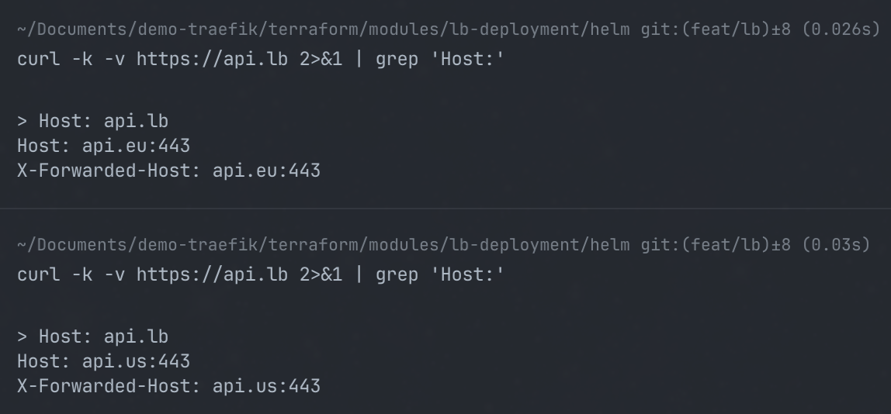

## Terraform config

## Setup

We are using terraform workspaces to manage different environments. The workspaces are:
- `local`: For local development using Vagrant VMs.
- `azure`: For deploying to Azure.

# To create the workspaces, run the following commands:

```bash

terraform workspace new local
terraform workspace new azure
terraform init
```

### Local deployment (with the Vagrant VMs) 
```bash
terraform workspace select local
```

### Azure test

Prerequisites:
- Install [Azure CLI](https://docs.microsoft.com/en-us/cli/azure/install-azure-cli).
```bash
brew install azure-cli
```
```bash
terraform workspace select azure
```
```bash
az login
az account set --subscription "YOUR_SUBSCRIPTION_NAME_OR_ID"
```

Generate the ssh keys for the VMs:

```bash
ssh-keygen -t rsa -b 2048 -f ~/.ssh/azure_vm
cat ~/.ssh/azure_vm.pub # Put that value in the `azure.tfvars` file
```bash

```bash
terraform apply -var-file=azure.tfvars
```


### Api deployment module
This module deploys the foobar API.

The goal is to be able to deploy the API with a single command, using the `terraform apply` command in each of our regional clusters.

### Load balancer deployment module
This module deploys the load balancer for the API.
The goal is to be have in front of our 2 regional clusters a load balancer that will route the traffic to the API pods in the regional clusters.

Initially the loadbalancer was using the geoip2 middleware to add the country code to the request header, but this was removed because right now it seems like the middleware headers are added after the request is routed by traefik in the ingress route. This means we add a country code to the header after traefik already decided which service to route the request to.

To fix this we need to have the geoip information sooner this is done by a cloudflare proxy that will add the country code to the request header before it reaches the load balancer.

It was very interesting though to learn how to install traefik plugins and use middlewares.

In local development the loadbalancer use a round robin strategy to route the traffic to the 2 regional clusters.

To check this round robin we can do the following command:

```bash
curl -k -v https://api.lb 2>&1 | grep 'Host:'
```

We see the alternation of the 2 regional clusters in the output.

