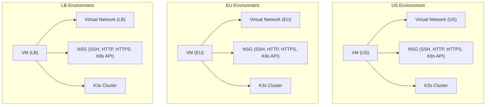
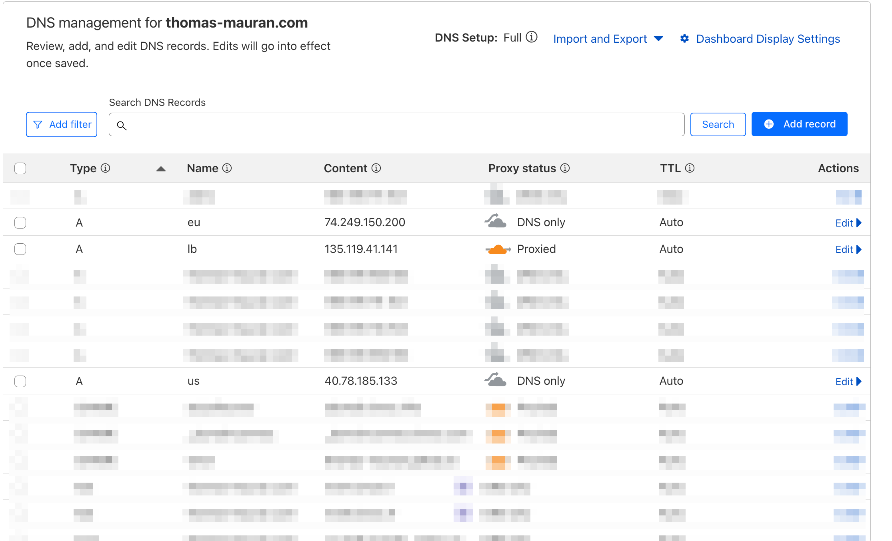
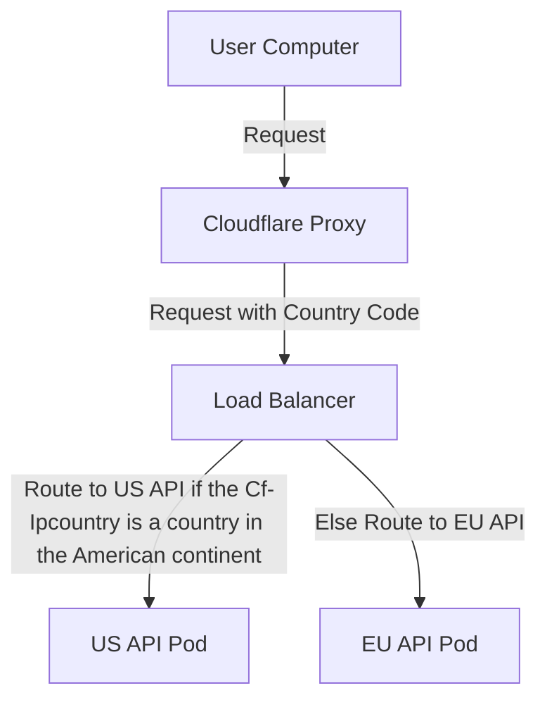

## Terraform config

## Setup

We are using terraform workspaces to manage different environments. The workspaces are:
- `local`: For local development using Vagrant VMs.
- `azure`: For deploying to Azure.

**To create the workspaces, run the following commands:**

```bash
terraform workspace new local
terraform workspace new azure
```
Make sure you fill the tf.vars files with the necessary values. You have an example in the `terraform/auto.tfvars.example` file.

### Local deployment (with the Vagrant VMs) 

```bash
terraform workspace select local
terraform init
```

#### 1 Create the infrastructure with Vagrant
We are using Vagrant to create the infrastructure for the local development environment. The Vagrantfile is already set up to create 3 VMs: `vm-eu`, `vm-us`, and `vm-lb`.

Make sure you have the Vagrant VMs running as described in the [Vagrant Virtual Machine](../vagrant/README.md) section.

#### 2 Install the API and load balancer on the Vagrant VMs using Terraform
You can install the api on the different clusters using the following command:

```bash
terraform apply \
  -target=module.api_deployment_us_local \
  -target=module.api_deployment_eu_local \
  -target=module.lb_deployment_local
```
This command will deploy the API on the US and EU clusters and set up the load balancer.

In local development the loadbalancer use a round robin strategy to route the traffic to the 2 regional clusters.

To check this round robin we can do the following command:

```bash
curl -k -v https://api.lb 2>&1 | grep 'Host:'
```

We see the alternation of the 2 regional clusters in the output.


### Azure deployment (Terraform)
This section describes how to deploy the infrastructure and the API on Azure using Terraform.

Prerequisites:
- Install [Azure CLI](https://docs.microsoft.com/en-us/cli/azure/install-azure-cli).
```bash
brew install azure-cli
```
```bash
terraform workspace select azure
terraform init
```
```bash
az login
az account set --subscription "YOUR_SUBSCRIPTION_NAME_OR_ID"
```

Generate the ssh keys for the VMs:

```bash
ssh-keygen -t rsa -b 2048 -f ~/.ssh/azure_vm
cat ~/.ssh/azure_vm.pub # Put that value in the `azure.tfvars` file
```

Right now the deployment in Azure is in 3 steps:

1. Create the infrastructure (VMs, networks, etc.)
2. Change the dns settings to point to the machines (this is mandatory for cert-manager to work and generate the certificates)
3. Deploy the API and load balancer on the created infrastructure.


#### 1 Create the infrastructure on Azure

Obviously nobody wants to deploy manually the infrastructure on Azure, so we are using terraform to do that.

```bash
# Create the Infrastructure on Azure
terraform apply \
  -target=module.infra_us \
  -target=module.infra_eu \
  -target=module.infra_lb
```

This command will create the following architecture:



- 3 groups of resources are created, one for each environment (US, EU, LB).
- Each group contains a VM (ubuntu), a virtual network, a network security group (NSG), and a K3s cluster is installed using cloudinit.
- The VMs are configured to allow SSH, HTTP, HTTPS, and Kubernetes API traffic.
- Each VM has a kubeconfig file generated and copied to the `terraform/kubeconfigs/azure` directory.
- each VM has a public IP address assigned which is available in the tf output

example output:
```bash
eu_ssh = "ssh demo-traefik@74.249.150.200"
eu_vm_ip = "74.249.150.200"
lb_ssh = "ssh demo-traefik@135.119.41.141"
lb_vm_ip = "135.119.41.141"
us_ssh = "ssh demo-traefik@40.78.185.133"
us_vm_ip = "40.78.185.133"
```


### 2 Change the Cloudflare DNS settings

Right now we are using Cloudflare proxy in front of the LB to add the country code to the request header before it reaches the load balancer.
To change the DNS settings, you need to update the Cloudflare DNS records to point to the public IP addresses of the VMs.



### Api deployment module
This module deploys the foobar API.

The goal is to be able to deploy the API with a single command. This will use the previously generated kubeconfig files to connect to the K3s clusters and deploy the API.

```bash
terraform apply \
  -target=module.api_deployment_us \
  -target=module.api_deployment_eu \
  -target=module.lb_deployment
```

After that the API should be accessible through the load balancer at `https://lb.<your-hostname>`.
for this demo everything is running under `thomas-mauran.com`, so the API is accessible at `https://lb.thomas-mauran.com`.

we also can directly access the API in each region:
- US: `https://us.thomas-mauran.com`
- EU: `https://eu.thomas-mauran.com`

France based request example:
```bash
curl https://lb.thomas-mauran.com
Hostname: api-69cb5c5b9d-9kh7f
IP: 127.0.0.1
IP: ::1
IP: 10.42.0.9
IP: fe80::8ce2:59ff:fe6b:d266
RemoteAddr: 10.42.0.8:56856
GET / HTTP/1.1
Host: eu.thomas-mauran.com:443
User-Agent: curl/8.7.1
Accept: */*
Accept-Encoding: gzip, br
Cdn-Loop: cloudflare; loops=1
Cf-Connecting-Ip: 2a01:cb1d:905b:1a00:bcab:6166:fe7e:c7bd
Cf-Ipcountry: FR
Cf-Ray: 94f8a9ad9d2e8a1c-MRS
Cf-Visitor: {"scheme":"https"}
X-Forwarded-For: 10.42.0.1
X-Forwarded-Host: eu.thomas-mauran.com:443
X-Forwarded-Port: 443
X-Forwarded-Proto: https
X-Forwarded-Server: traefik-7cf4744995-5nrbq
X-Real-Ip: 10.42.0.1
```

We see here is the response from the eu api, which basically echos the headers and infos of the request.
lets break down the headers and what happened here:
- `Host`: eu.thomas-mauran.com, the request was handled by the eu api.
- `Cf-Ipcountry`: FR, this is the country code added by Cloudflare proxy in front of the loadbalancer based on the IP address of the request.

Here is a schematic representation of the request flow:


US based response example:
```bash
curl https://lb.thomas-mauran.com
Hostname: api-69cb5c5b9d-7ftxj
IP: 127.0.0.1
IP: ::1
IP: 10.42.0.9
IP: fe80::3c1e:19ff:fe41:8dc6
RemoteAddr: 10.42.0.8:54570
GET / HTTP/1.1
Host: us.thomas-mauran.com:443
User-Agent: curl/8.5.0
Accept: */*
Accept-Encoding: gzip, br
Cdn-Loop: cloudflare; loops=1
Cf-Connecting-Ip: 20.124.83.161
Cf-Ipcountry: US
Cf-Ray: 94f8a8e0180305f3-IAD
Cf-Visitor: {"scheme":"https"}
X-Forwarded-For: 10.42.0.1
X-Forwarded-Host: us.thomas-mauran.com:443
X-Forwarded-Port: 443
X-Forwarded-Proto: https
X-Forwarded-Server: traefik-7cf4744995-dtggl
X-Real-Ip: 10.42.0.1

```
In this case, the request was routed to the US API because the `Cf-Ipcountry` header is `US`, which is a country in the American continent.

### But why do we need a proxy in front of the load balancer?

Initially the loadbalancer was using the geoip2 middleware to add the country code to the request header, but this was removed because right now it seems like the middleware headers are added after the request is routed by traefik in the ingress route. This means we add a country code to the header after traefik already decided which service to route the request to.

To fix this we need to have the geoip information sooner the easiest way to do so is by using cloudflare proxy that will add the country code to the request header before it reaches the load balancer.

We could have used any kind of proxy in front, even another service with only traefik and the geoip middleware, but we chose to use Cloudflare proxy to demonstrate this setup.

In the end even if we are not using the geoip middleware itself, it was very interesting to learn how to install traefik plugins and use middlewares.
